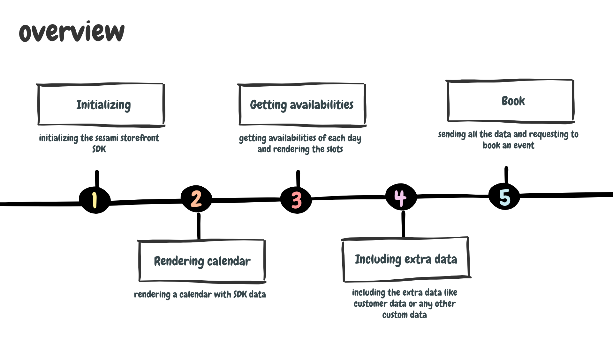

# Dive Right In:Learn Storefront SDK the Fun Way! 🚀✨😎

Hi there! we’ll be diving into the Storefront SDK by building a calendar together. It's a fun and practical way to learn as we go. So, without wasting any time, let’s jump right in!

## Overview

Turning Where am I 😖 into I got this 😎



## Initializing

for initializing the SDK first we need the SDK!
i will add SDK cdn to my project , you can just copy this and include it in you project

```js
<script async src="https://cdn.sesami.co/sdk.js"></script>
```

now we need to create an instance of SDK
i will create a main.js file and in it

```js
let SDKInstance = new SesamiSDK({
      variantId: {{product.selected_or_first_available_variant.id}},
      shopId: {{shop.id}},
      productId: {{product.id}},
      quantity: 1,
      autoLoad: true
    })
```

store the SDKInstance in a place that you can access it easily , in my case i will store it in `window.sesamiSDK`

```js
window.sesamiSDK = SDKInstance;
```

💡 **Tip:** Remember to activate the instant booking option in the shop settings. If you don’t, the SDK instance will fail to generate.

## Rendering Calendar

Each SDK instance will include a data object. You can find a sample data set [here](your-link-here).

### Object Structure

The object has a `data` property with the following structure:

| Property | Type                            | Description                                     |
| -------- | ------------------------------- | ----------------------------------------------- |
| `labels` | `Array<Date>`                   | An array of `Date` objects.                     |
| `rows`   | `Array<Array<SesamiDayObject>>` | A 2D array containing `SesamiDayObject` arrays. |

#### Example

Here’s an example of what the `data` property might look like:

```json
{
  labels: [Sun Dec 05 2021 00:00:00 {}, Mon Nov 29 2021 00:00:00 {}, ...],
  rows: [
            [
                {
                    date: Sun Nov 28 2021 00:00:00 {}
                    getAvailabilities: async ƒ ()
                    isCurrentMonth: false
                    isCurrentWeek: false
                    isPast: true
                    isToday: false
                }
                ...
            ]
            ...
        ]
}
```

we use the `labels` to render the label section of the calendar like
| Su | Mo | Tu | We | Th | Fr | Sa |
|----|----|----|----|----|----|----|
| | | | | | | |

like this

```js
// helper
const dayName = (date) =>
  new Intl.DateTimeFormat("en-US", { weekday: "short" }).format(date);

window.sesamiSDK.data.labels.map((dateString) => {
  calendarLabels.innerHTML += `<li >${dayName(new Date(dateString))}</li>`;
});
```

and we use `rows` to generate the days of the calendar like
| | | | | | | |
|----|----|----|----|----|----|----|
| 1 | 2 | 3 | 4 | 5 | 6 | 7 |
| 8 | 9 | 10 | 11 | 12 | 13 | 14 |
| 15 | 16 | 17 | 18 | 19 | 20 | 21 |
| 22 | 23 | 24 | 25 | 26 | 27 | 28 |
| 29 | 30 | | | | | |

Each array in `rows` represents a row and contains the days for that row.

### Day Object Structure

| Property              | Type             | Description                                                                                                                                                                                             |
| --------------------- | ---------------- | ------------------------------------------------------------------------------------------------------------------------------------------------------------------------------------------------------- |
| `date`                | `Date`           | Represents the date for this day.                                                                                                                                                                       |
| `getAvailabilities()` | `Async Function` | Returns a promise that resolves to an array of available slots: `Promise<Array<SesamiSlotObject>>`.                                                                                                     |
| `isCurrentMonth`      | `Boolean`        | Indicates if this day is within the same month as the currently set date.                                                                                                                               |
| `isCurrentWeek`       | `Boolean`        | Indicates if this day is within the same week as the currently set date.                                                                                                                                |
| `isPast`              | `Boolean`        | Indicates if this day is in the past.                                                                                                                                                                   |
| `isToday`             | `Boolean`        | Indicates if this day is today.                                                                                                                                                                         |
| `onLoad(callback)`    | `Function`       | The callback function receives cell availabilities for the currently selected range; requires autoLoad to be enabled. This method triggers a network request only if the data is not already available. |
| `onError(callback)`   | `Function`       | The callback function receives any errors when retrieving cell availabilities for the selected range.                                                                                                   |

i will use all this data to make the days of our calendar like this

```js
// Initialize an empty object to store all availabilities
let allAvailabilities = {};

// Helper function to convert a date to ISO string format (YYYY-MM-DD)
const toIso = (date) => date.toISOString().split("T")[0];

// Process each row in the Sesami SDK data
window.sesamiSDK.data.rows.forEach((row, rowIndex) => {
  row.forEach(async (day) => {
    // Determine the CSS class based on whether the day is in the past
    const className = day.isPast ? "inactive" : "active";

    // Create and configure a new list item element for the day
    const dayElement = document.createElement("li");
    dayElement.className = className;
    dayElement.textContent = getDayNumber(new Date(day.date));

    // Append the day element to the container for days
    days.appendChild(dayElement);

    // Fetch availabilities for the day and store them
    try {
      const availabilities = await day.getAvailabilities();
      const isoDate = toIso(new Date(day.date));
      allAvailabilities[isoDate] = availabilities;
    } catch (error) {
      console.error(`Error fetching availabilities for ${day.date}:`, error);
    }

    // Add a click event listener to handle day selection
    dayElement.addEventListener("click", () => {
      if (!day.isPast) {
        selectDay(day, allAvailabilities);
      }
    });
  });
});
```

💡 **Tip:** There are several ways to handle day availabilities. One approach is to fetch the availabilities for each day only when it's selected. Alternatively, you could collect all availabilities in a single array and then filter it to find specific data. In this example, I chose to store all availabilities in a large object, using date keys for quick access. This method allows for efficient lookups by date.

## Getting Availabilities

now that we got our days rendered and we stored all the availabilities, its time to render our available slot but before that lets take look at the slot structure

### Slot Object Structure

| Property         | Type     | Description                                              |
| ---------------- | -------- | -------------------------------------------------------- |
| `duration`       | `Number` | The duration of the slot in minutes.                     |
| `remainingSlots` | `Number` | The number of slots remaining.                           |
| `startTime`      | `String` | The start time of the slot in "YYYY-MM-DD HH:MM" format. |
| `status`         | `String` | The availability status of the slot.                     |

#### Example

```json
{
  duration: 15
  remainingSlots: 1
  startTime: "2022-12-30 10:00"
  status: "available"
}
```

you can use this data in your UI as you like and add a click event to it, when user clicked on it store the slot data (ex : selectedSlot)

## Including Extra Data

there are two types of data that you attach to the book request

1. **SesamiCustomerObject**
2. **SesamiOptionsObject**

`SesamiCustomerObject` is required and it contained customer data

### SesamiCustomerObject Structure

| Property    | Description             | Example        |
| ----------- | ----------------------- | -------------- |
| `email`     | customer email address. | john@smith.com |
| `firstName` | customer first name.    | John           |
| `lastName`  | customer last name.     | Smith          |
| `phone`     | customer phone number.  | +12223333333   |

#### Example

```json
{
  email: "john@smith.com"
  firstName: "John"
  lastName: "Smith"
  phone: "+12223333333"
}
```

`SesamiOptionsObject` is optional and can be used to store any data you choose, as long as you follow the required format.

### SesamiCustomerObject Format

The customer object contains a property named `properties`, which is an array of objects with the following format:
| Property | Type |
|----------|--------|
| `name` | `String`|
| `value` | `String`|

#### Example

```json
{
  properties:[
    {
      name: "How old are you?"
      value: "18"
    }
    {
      name: "Marital Status"
      value: "Single"
    }
  ]
}
```

💡 **Tip:** Remember to store each value, such as `SesamiCustomerObject` and `SesamiOptionsObject`, in separate variables. We will use these variables later when we want to book an event.

## Book

finally we are here!
now you can book an event using SDK instant and the data you gathered

```js
await window.sesamiSDK.book(selectedSlot, customerObject, optionsObject);
```

## Hold On!

There’s much more to the SDK than what we've covered. This document aimed to simplify the workflow and help you achieve results quickly while giving you a foundational understanding of how the SDK works. To fully utilize the SDK, you’ll need additional methods, such as next, previous, and more. You can explore these and other features in the Storefront SDK documentation.
