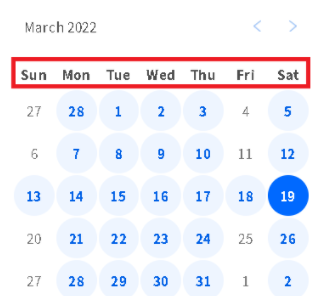
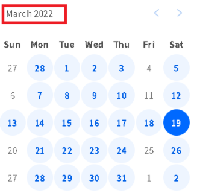
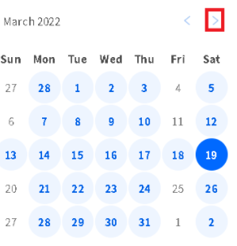
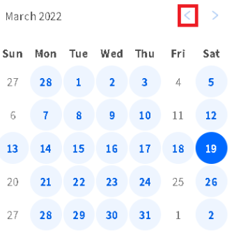
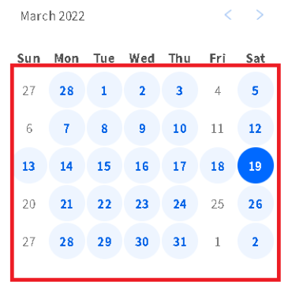
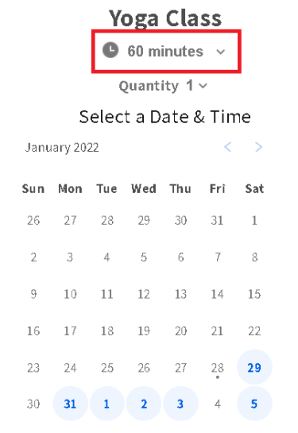
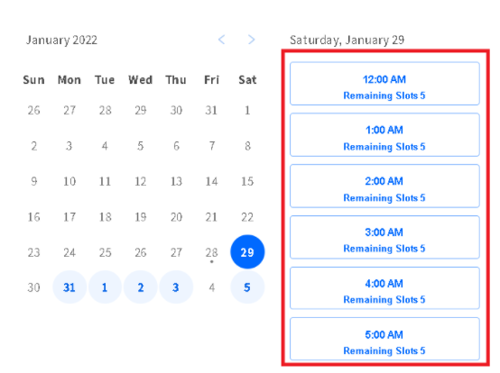
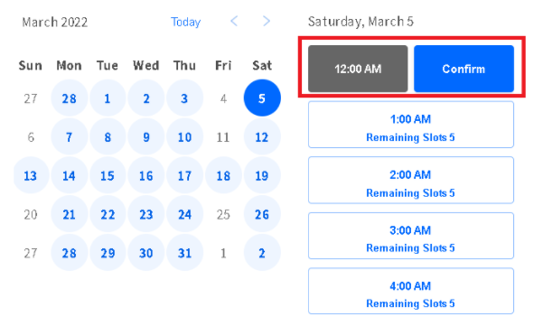

# Storefront SDK examples

Example of a customized booking experience using Sesami SDK.

## Get weekdays labels

Use `sesami.data.labels` to get the calendar's weekdays, and the helper `sesami.formatDate` to format the weekday.



```js
sesami.data.labels.map(date => {
let weekday = sesami.formatDate(date, {weekday: "short"})
})
```

## Get the currently selected date

Use `sesami.now` to get currently selected date on the calendar, and the helper `sesami.formatDate` to format the date.



```js
sesami.formatDate(sesami.now, {month: "short", year: "numeric"})
```

## Navigate to the next month
Use `sesami.next` to move to the next month in the calendar.



```js
sesami.next("month")
```

## Navigate to the previous month
Use `sesami.previous` to move to the previous month in the calendar.



```js
sesami.previous("month")
```
## Get calendar days

Use `sesami.data.rows` to get all the days/cells for the current month. The following code
iterates over each row and column to populate each day in a month.



```js
const getRow = (data) => {
  data.map(cell => {
    return sesami.formatDate(cell.date, {day: "numeric"})
  }
}

let rows = Sesami.data.rows.map(getRow)
```
## Get calendar days with availabilities

Use `getAvailabilities` to get a promise of available slots. The following code
iterates over each row and column to populate each day in a month and calls
`getAvailabilities` to get the available slots for each day.


```js
const getRow = (data) => {
  data.map(cell => {    
    if(!cell.isPast){
      cell.getAvailabilities()
      .then((availabilities) => 
      {
        if(availabilities && availabilities.length)
          console.log("available");        
      })
      .catch(err => 
      {
        console.error("Error getting availabilities", err)    
      })
    }
    return sesami.formatDate(cell.date, {day: "numeric"})
  }
 }

let rows = Sesami.data.rows.map(getRow)
```
## Change variant

Use `sesami.setVariantId` to change the duration for the service.



```js
sesami.setVariantId(variantId)
```
## Get available slots

Iterate over the slots returned by `getAvailabilities` to get `slot.startTime` and `slot.remainingSlots`,
use `sesami.formatDate` to format the date.



```js
availabilities.map(slot =>{
  let time = sesami.formatDate(new Date(slot.startTime), {hour: 'numeric', minute: 'numeric'})                             
  letRemainingSlots = slot.remainingSlots
})
```
## Add slot to cart

For  the selected  slot  (returned previously by  `getAvailabilities`) we get  a set of hidden input fields to add a product with the selected time slot as line item properties to the cart.



```markup
<script>
  const onSlotSelect = slot => {
    const hiddenFields = document.getElementById("hiddenFields")
    hiddenFields.innerHTML = ""
    hiddenFields.appendChild(sesami.getSesamiFields(slot))
    document.getElementById("sesamiForm").submit()    
  }
</script>

<form method="post" action="/cart/add" id="sesamiForm">
  <!-- set your variantid on the value property. -->
  <input type="hidden" name="id" id="variantID" value="">
  <input type="hidden" name="quantity" id="qty" value="1">
  <div class="hiddenFields" id="hiddenFields"></div>
</form>
```