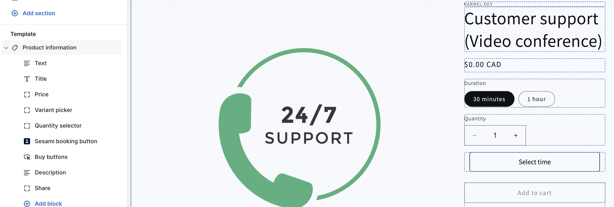

# Anatomy of Sesami button

After Shopify 2.0, We introduced a new Shopify section block to help the merchants in adding the Sesami button with no custom code, wherever they want in a product page.

<!--  -->

#### Rendered result
This is a final rendered markup that Sesami creates to capture booking information:

```html
<!--- Anything in this code block is generated automatically --->
<sesami-button 
  shop-id="" 
  product-id="" 
  button-label="" 
  locale="" 
  button-customized-settings="" 
  style="align-items: center;">
    <button type="button" 
      sesami-button="" 
      class="sesami__button" 
      style="">Select time
    </button>
</sesami-button>

<div sesami-inputs="">
  <input type="hidden" name="properties[Date]" sesami-date="">
  <input type="hidden" name="properties[Time]" sesami-time="">
  <input type="hidden" name="properties[Timezone]" sesami-timezone="">
  <input type="hidden" name="properties[Team Member]" sesami-teammember="">
  <input type="hidden" name="properties[_locale]" sesami-_locale="" value="en">
  <input type="hidden" name="remainingSlots" sesami-remainingslots="">
</div>
```

:::note

The above markup will only be generated if the current product is a Sesami service; otherwise, it will do nothing, and your other products won't be affected in any way.

:::

### Sesami Block Attributes

The Sesami button can be customized in many ways; this is mostly done by playing with the listed options in the Sesami Shopify Block, Below items are customized from the Shopify theme editor:

  1. **Auto add to cart**: By choosing this attribute, the selected date/time will be automatically added to the cart without the need to submit the ATC form. Additionally, you may need to include the following script to redirect customers to the cart after the item is added.
  
     ```html title="main-product.liquid"
     <script>
        document.addEventListener("DOMContentLoaded", function(event) {
          var sesamiDateInput = document.querySelector("[name^='properties[date]']");
          if(!sesamiDateInput){
            sesamiDateInput = document.querySelector("[name^='properties[Date]']");
          }
          sesamiDateInput.addEventListener("change", function(){
            setTimeout(function () {
              window.location.href="/cart"
            }, 1500);
              
          });
        });
      </script>
     ```
  2. **Skip cart**
  3. **Button label**
  4. **Styles**
     *  Button allignment
     *  Font size
     *  Border width
     *  Border radius
     *  Border color
     *  Button width
     *  Button height
  5. **Calendar experience**

## Shopify 2.0 Manual integration

In certain custom themes, Sesami may face difficulty identifying the Block added in the theme editor. In such cases, we may need to manually integrate the Sesami button within a specific snippet or section. This involves removing the block from the theme editor and then inserting the following snippet of code wherever we wish to place the Sesami button.

```html title="main-product.title"
<form action="/cart/add">
  <input type="hidden" name="id" value="{{product.selected_or_first_available_variant.id}}">
  <input type="hidden" name="quantity" value="1">
  <sesami-button 
    shop-id="{{shop.id}}" 
    product-id="{{product.id}}"
    button-label="Select Time"
    locale="{{ localization.language.iso_code }}"
    button-customized-settings="%7B%22auto_add_to_cart%22%3Afalse%2C%22skip_cart%22%3Afalse%2C%22button-label%22%3A%22Select time%22%2C%22alignment%22%3A%22center%22%2C%22color%22%3A%22%22%2C%22color_background%22%3A%22%23FFF%22%2C%22font_size%22%3A16%2C%22border_width%22%3A1%2C%22border_radius%22%3A4%2C%22border_color%22%3A%22%23000%22%2C%22width%22%3A%22300px%22%2C%22height%22%3A%2245px%22%2C%22experience%22%3A%22classic%22%7D" 
    style="align-items: center;">
  </sesami-button>
  <input type="submit" style="display: none">
</form>
```

## Options

### product-id
If you want to render a button on a page different from a product page, you'll need to tell Sesami for which product you are rendering a button. Depending on your implementation, if you are rendering the button outside a product form or if a variant input is not present on the form, you might need to add a [variant-id](#variant-id) as well.

```html {3}
<sesami-button
  .
  product-id="XXXXXXXXXXXX"
  .
/>
```

### variant-id
If you want to render a button on a page different from a product page, you'll need to tell Sesami for which variant you are rendering a button. You always need to specify the [product-id](#product-id) when using this option

```html {3}
<sesami-button
  .
  data-sesami-product-id="XXXXXXXXXXXX"
  data-sesami-variant-id="XXXXXXXXXXXX"
  .
/>
```

### shop-id
If you want to integrate Sesami in an external page or website, you'll need to tell Sesami for which store you want to display the button; this is done by providing the `shop-id` option:

**Both [variant-id](#variant-id) and [product-id](#product-id) are required when using this option.**

:::info Where can I find my shop ID?

Each store has its own shop id which can be fetched by visiting this address after replacing `STORE` with your store address: http://STORE.myshopify.com/admin/shop.json
:::

```html {3}
<sesami-button
  .
  shop-id="XXXXXXXXXXXX"
  data-sesami-product-id="XXXXXXXXXXXX"
  data-sesami-variant-id="XXXXXXXXXXXX"
  .
/>
```

If you need to load Sesami on an external page (like a WordPress website), you'll need to add this line of code to your page:

```html
<script async src="https://cdn.sesami.co/shopify.js"></script>
```

### locale
Sometimes you might need Sesami calendar to be displayed in a different language than what is set as your primary language. This is primarily useful if you have a multi-lingual store:

```html {3}
<sesami-button
  .
  locale="{{ localization.language.iso_code }}"
  .
/>
```

### button-label
You can display any label on the button; this is useful if you'd like to conditionally render different labels based on product or context. If this option is not provided, it will display what is set on the settings page in Sesami app.

```html {3}
<sesami-button
  .
  button-label="Select Time"
  .
/>
```

### Button styling
The value of `button-customized-settings` is an encoded string that can be modified through the following steps:

1. Decode it using any online string decoder like [this one](https://dencode.com/en/string)
2. After decoding, you'll get the following JSON:
    ```json
    {
      "auto_add_to_cart": false,
      "skip_cart": false,
      "button-label": "Select time",
      "alignment": "center",
      "color": "",
      "color_background": "#FFF",
      "font_size": 16,
      "border_width": 1,
      "border_radius": 4,
      "border_color": "#000",
      "width": "300px",
      "height": "45px",
      "experience": "classic"
    }
    ```
3. Modify the properties as needed.
4. Encode it again using online encoders.

## CSS custom styling
you can add custom css styling by attaching CSS properties to `sesami__button`

```css
.sesami__button{

}
```

